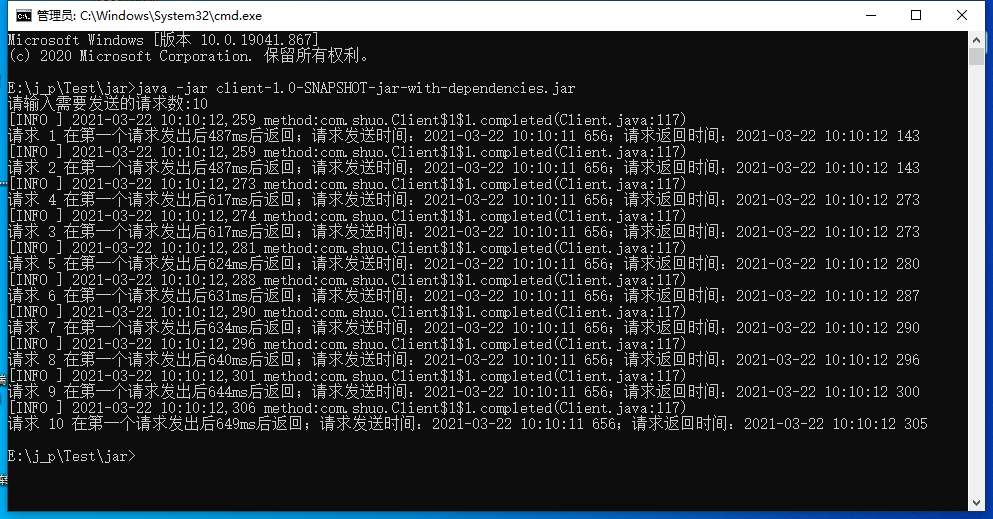
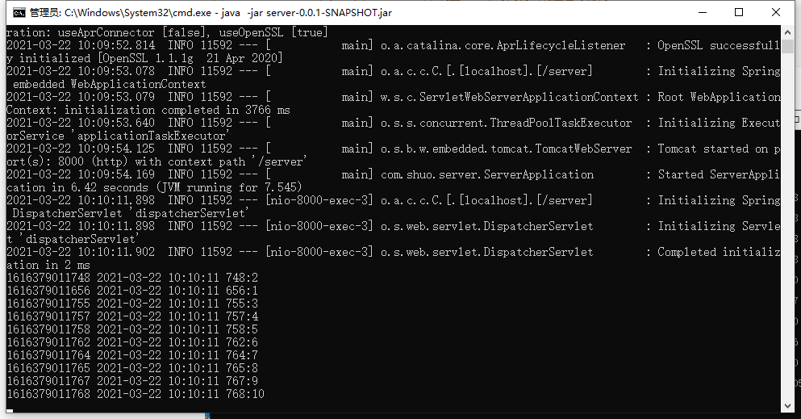

 # 代码运行

``` cmd
#进入jar文件目录下
#先启动服务端server
java -jar server-0.0.1-SNAPSHOT.jar
#在启动客户端client
java -jar client-1.0-SNAPSHOT-jar-with-dependencies.jar
```


# 代码介绍

### 客户端：

将请求序号传入getRequest函数封装http请求，并将时间戳作为请求数据一并存入request中：

```java
public static HttpPost getRequest(String sequence) {
        //请求地址
        String url = "http://localhost:8000/server/request";
        HttpPost httpPost = new HttpPost(url);
        httpPost.setHeader("Content-Type", "application/x-www-form-urlencoded");
        List<NameValuePair> list = new LinkedList<>();
        //sequence为第几个请求，requestTimeStamp为请求发送时间戳
        list.add(new BasicNameValuePair("sequence", sequence));
        list.add(new BasicNameValuePair("requestTimeStamp", String.valueOf(System.currentTimeMillis())));
        try {
            httpPost.setEntity(new UrlEncodedFormEntity(list));
        } catch (UnsupportedEncodingException e) {
            e.printStackTrace();
        }
        return httpPost;
    }
```

判断第n个请求是否在第n秒内返回

```java
private static boolean outOfTime(int sequence, long startTime, long endTime) {
    if ((endTime - startTime) <= (sequence * 1000)) {
        return false;
    } else {
        return true;
    }
}
```

通过HttpAsyncClient发送异步请求，主线程启动，通过控制台输入获取要发送的请求数n，并启动对应数量线程实现并发请求，通过加锁控制发送请求的顺序，通过CountDownLatch来控制程序结束。此外，创建定时器在n秒后，若n秒后主线程未结束，定时器执行，表明相应返回失败，并在日志打印输出。

```java
public static void main(String[] args) throws InterruptedException {
        //o用作于锁定对象
        Object o = new Object();
        //输入获取要发送的请求数
        int sendRequestNum = -1;
        //开启latch个线程，当所有线程执行完后停止主线程
        final CountDownLatch latch;

        CloseableHttpAsyncClient httpclient = HttpAsyncClients.createDefault();
        httpclient.start();

        Scanner scan = new Scanner(System.in);
        //时间戳转化为日期时间
        SimpleDateFormat df = new SimpleDateFormat("yyyy-MM-dd HH:mm:ss SSS");


        System.out.print("请输入需要发送的请求数:");
        sendRequestNum = scan.nextInt();

        if (sendRequestNum > 0) {

            latch = new CountDownLatch(sendRequestNum);

            //每个请求开启一个线程
            for (int i = 1; i <= sendRequestNum; i++) {
                new Thread(new Runnable() {
                    @Override
                    public void run() {
                        //加锁以确保请求发送的顺序性
                        synchronized (o) {
                            requestNum++;
                            HttpPost request = Client.getRequest(requestNum + "");
                            httpclient.execute(request, new FutureCallback<HttpResponse>() {
                                @Override
                                public void completed(HttpResponse httpResponse) {
                                    HttpEntity entity = httpResponse.getEntity();
                                    long responseTimeStamp = System.currentTimeMillis();
                                    String endTime = df.format(Long.valueOf(responseTimeStamp));
                                    try {
                                        JSONObject message = JSONObject.parseObject(EntityUtils.toString(entity, "UTF-8"));
                                        int sequence = Integer.valueOf((String) message.get("sequence"));
                                        long requestTimeStamp = Long.valueOf((String) message.get("requestTimeStamp"));
                                        if (sequence == 1) {
                                            startTimeStamp = requestTimeStamp;
                                            startTime = df.format(Long.valueOf(startTimeStamp));
                                        }
                                        //若还未获取到第一个请求的发出时间，则阻塞等待
                                        while(startTime == null){}
                                        long timeSpending = responseTimeStamp - startTimeStamp;
                                        //检验当前请求收到时间是否超过期望时间
                                        boolean flag = outOfTime(sequence, startTimeStamp, responseTimeStamp);
                                        if(flag == true){
                                            log.error("响应失败，请求" + message.get("sequence") + " 在第一个请求发出后" + timeSpending + "ms后返回；超过期望时间；  请求发送时间：" + startTime + "；请求返回时间：" + endTime);
                                        }
//                                        System.out.println("请求 " + message.get("sequence") + " 在第一个请求发出后" + timeSpending + "ms后返回；请求发送时间：" + startTime + "；请求返回时间：" + endTime);
                                        log.info("请求 " + message.get("sequence") + " 在第一个请求发出后" + timeSpending + "ms后返回；请求发送时间：" + startTime + "；请求返回时间：" + endTime);
                                        latch.countDown();
                                    } catch (IOException e) {
                                        e.printStackTrace();
                                    }


                                }

                                @Override
                                public void failed(Exception e) {
                                    log.error("请求响应回调failed");
                                }

                                @Override
                                public void cancelled() {
                                    log.error("请求响应回调cancelled");
                                }
                            });
                        }
                    }
                }).start();
            }
            //开启定时器，如果n秒后主线程未结束，则触发定时器，表面返回失败,并记录日志
            new Timer("timer").schedule(new TimerTask() {
                @Override
                public void run() {
                    if(responseNum != requestNum){
                        log.error("发送请求数：" + requestNum + "；返回请求数：" + responseNum + "；未在" + requestNum + "秒内收到所有相应，返回失败");
                    }
                }
            }, sendRequestNum * 1000);


        }else{
            latch = new CountDownLatch(0);
            System.out.println("输入错误！");
        }

        latch.await();
        System.exit(0);
    }
```

日志输出配置

```properties
### 设置###
#log4j.rootLogger = debug,stdout,D,E
log4j.rootLogger = info,stdout,I,E
### 输出信息到控制台 ###
log4j.appender.stdout = org.apache.log4j.ConsoleAppender
log4j.appender.stdout.Target = System.out
log4j.appender.stdout.layout = org.apache.log4j.PatternLayout
log4j.appender.stdout.layout.ConversionPattern = [%-5p] %d{yyyy-MM-dd HH:mm:ss,SSS} method:%l%n%m%n

### 输出Info 级别以上的日志到=E:/logs/log.log ###
log4j.appender.I = org.apache.log4j.DailyRollingFileAppender
log4j.appender.I.File = E:/logs/log.log //可修改Info级别日志文件保存路径
log4j.appender.I.Append = true
log4j.appender.I.Threshold = DEBUG
log4j.appender.I.layout = org.apache.log4j.PatternLayout
log4j.appender.I.layout.ConversionPattern = %-d{yyyy-MM-dd HH:mm:ss}  [ %t:%r ] - [ %p ]  %m%n

### 输出ERROR 级别以上的日志到=E:/logs/error.log ###
log4j.appender.E = org.apache.log4j.DailyRollingFileAppender
log4j.appender.E.File =E:/logs/error.log //可修改Erro级别日志文件保存路径
log4j.appender.E.Append = true
log4j.appender.E.Threshold = ERROR 
log4j.appender.E.layout = org.apache.log4j.PatternLayout
log4j.appender.E.layout.ConversionPattern = %-d{yyyy-MM-dd HH:mm:ss}  [ %t:%r ] - [ %p ]  %m%n
```

### 服务端：

新建springboot工程，编写对应Controller接受请求

```java
@PostMapping("/request")
@ResponseBody
public String request(String sequence, String requestTimeStamp) throws 		InterruptedException {
	SimpleDateFormat df = new SimpleDateFormat("yyyy-MM-dd HH:mm:ss SSS");
	String date = df.format(Long.valueOf(requestTimeStamp));
	System.out.println(requestTimeStamp +" " + date + ":" + sequence);

	//返回json数据
	Map<String,Object> map = new HashMap<>();
	map.put("sequence",sequence);
	map.put("requestTimeStamp",requestTimeStamp);

//	Thread.sleep(800);        //调整sleep时间测试响应超时情况
	//返回数据转化为json字符串
	return getJSONString(200,"响应请求"+sequence,map);
}
```

客户端：



服务端：




# 第三方库

HttpAsyncClient：发送post异步请求的Http客户端

Fastjson：将字符串数据转化为json或对json数据解析

Log4j：日志记录


